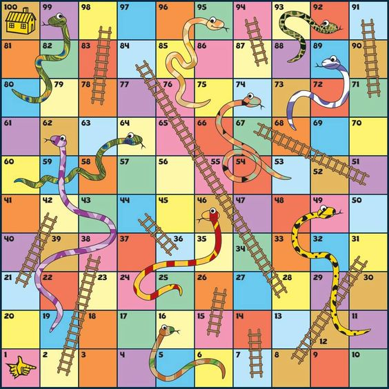

## Challenge 4

Create a class called SnakesLadders. The method play(die1, die2) will be called independently, regardless of the game's state or whose turn it is. The parameters die1 and die2 are integers between 1 and 6, representing the dice roll. The player moves forward by the sum of die1 and die2.

## The Board

## Rules

- There are two players, both starting at square 0.
- Player 1 goes first, then they alternate turns.
- The players move up the board sequentially from square 1 to square 100.
- If both dice show the same value, that player takes another turn.
- Landing on the bottom of a ladder allows the player to move up to the top of the ladder.
- Landing on the head of a snake moves the player down to the snake's tail.
- To win, a player must land exactly on square 100. If a roll exceeds 100, the player "bounces" back from square 100 by the excess amount. For example, from square 98, rolling a five moves the player to 100 and then back to 99, 98, and 97.
- If a player rolls a double and lands exactly on square 100, they win without needing another turn.

## Returns
- Return "Player n Wins!" when player n lands exactly on square 100.
- Return "Game over!" if a player tries to play after the game is already won.
- Otherwise, return "Player n is on square x", where n is the current player and x is their current square.